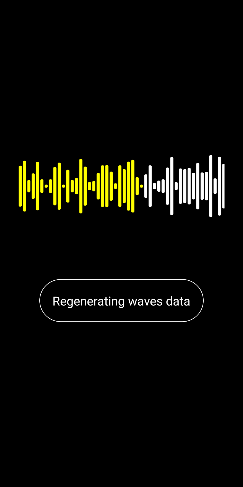

# react-native-waveform-seekbar

A `<WaveformSeekBar />` component for React-Native



## Platforms Supported

- [ ] iOS, Not started
- [x] Android, use [massoudss/WaveformSeekBar](https://github.com/massoudss/waveformSeekBar)

## Installation

```sh
npm install react-native-waveform-seekbar
```

## Usage

```js
import WaveformSeekBar from "react-native-waveform-seekbar";

// ./example/src/App.tsx
<WaveformSeekBar
  style={styles.box}
  data={data}
  backgroundColor="#fff"
  progressColor={'yellow'}
  onChange={(e) => console.log(e.nativeEvent)}
/>
```

## Interfaces

```ts
import React from 'react';
import { ViewStyle, StyleProp, NativeSyntheticEvent } from 'react-native';
export declare type OnChangeEvent = (e: NativeSyntheticEvent<{
    progress: number;
    fromUser: boolean;
}>) => void;
export declare type WaveformSeekBarProps = {
    style: StyleProp<ViewStyle>;
    data: number[];
    progress?: number;
    maxProgress?: number;
    visibleProgress?: number;
    waveWidth?: number;
    gap?: number;
    minHeight?: number;
    radius?: number;
    backgroundColor?: number;
    progressColor?: number;
    gravity?: 'top' | 'center' | 'bottom';
    onChange?: OnChangeEvent;
};
export interface Props extends Omit<WaveformSeekBarProps, 'backgroundColor' | 'progressColor'> {
    backgroundColor?: string;
    progressColor?: string;
}
export declare const WaveformSeekBar: React.FC<Props>;
```

## Thanks

- [massoudss/WaveformSeekBar](https://github.com/massoudss/waveformSeekBar)

## Contributing

See the [contributing guide](CONTRIBUTING.md) to learn how to contribute to the repository and the development workflow.

## License

MIT
